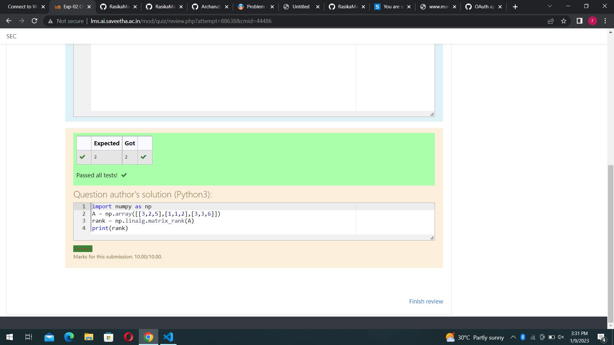

# RANK-OF-A-MATRIX
## Aim:
To write a python program to find the rank of a matrix
## Equipment’s required:
1. 	Hardware – PCs
2. 	Anaconda – Python 3.7 Installation / Moodle-Code Runner
## Algorithm:
### Step 1: import numpy package

### Step 2: get the input matrix

### Step 3: using the np.linalg.matrix_rank(), we can find the rank of the given matrix.

### Step 4: print the result

## Program:
```python
#Program to find the rank of a matrix.
#Developed by: rasika
#RegisterNumber:22005459
import numpy as np
A=np.array([[3,2,5],[1,1,2],[3,3,6]])
result=np.linalg.matrix_rank(A)
print(result)
```
## Output:

## Result:
Thus the rank for the given matrix is successfully solved by  using a python program.

